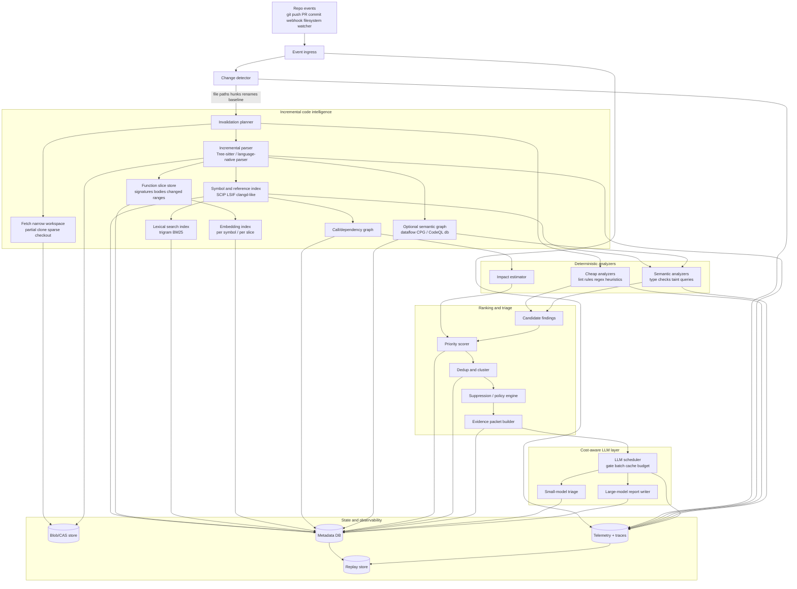

# Designing an Optimal Continuous Codebase Scanner for High-Value Bug Discovery

## Executive summary

The most effective design is not an “LLM reads the repo over and over” loop. In practice, the scanner should be an event-driven, incremental program-analysis system that keeps persistent code intelligence up to date, runs cheap deterministic analyzers continuously, and calls an LLM only on compact evidence packets assembled from changed symbols, relevant dependencies, and already-computed findings. The strongest practical blueprint combines patterns already visible in entity["company","GitHub","software hosting company"] CodeQL’s incremental pull-request analysis, entity["company","Semgrep","appsec tooling company"] diff-aware scanning, tools from entity["company","Meta","technology company"] such as Watchman and Infer, code search and code-intelligence indexing from entity["company","Sourcegraph","code intelligence company"], and index layering in entity["organization","LLVM","compiler infrastructure project"] clangd. citeturn17view6turn17view4turn17view5turn17view2turn18view5turn40view0

For an unspecified language stack, the best default is a polyglot architecture with a generic path and an optional precision path. The generic path uses Git diffs, filesystem events, Tree-sitter incremental parsing, lexical/symbol indexes, and selective embeddings. The precision path adds language-native semantic indexes such as SCIP or LSIF, compiler-backed indexes like clangd for C/C++, and heavier semantic representations such as a code property graph or CodeQL database only for the small minority of candidates that justify the cost. This minimizes latency and compute on the common path while preserving high recall for security-sensitive or high-impact findings. citeturn17view0turn20view1turn40view0turn32view4turn34view1turn34view2turn18view4turn35view2

Freshness and importance should dominate scheduling. A practical default is diff-aware scanning on every pull request or branch update, background watcher-driven invalidation between commits, and periodic full sweeps to catch drift, deleted files, rule changes, and missed dependency effects. Promotion should favor recent edits, high relative churn, low ownership concentration, strong change coupling, high fan-in, security-sensitive code, and corroborating runtime or test evidence. Those factors are empirically tied to defect-proneness or operational importance, and they allow the scanner to spend LLM budget where it is most valuable. citeturn38view0turn32view2turn32view3turn30view0turn30view1turn30view2turn35view0

The LLM should sit at the end of the funnel, not at the front. Send function-level or slice-level summaries, never whole files by default; keep stable instructions and schemas in a reusable prompt prefix; use structured outputs for machine-readable triage; and batch non-urgent calls asynchronously. Research on code summarization also points the same way: project-specific context improves summaries and reduces hallucination, but naïvely sending a whole repository is both expensive and noisy. citeturn28view4turn21view0turn21view1turn24view0turn24view1turn24view2

## System requirements and design principles

Because the language and platform are unspecified, the recommended design assumes a polyglot repository, repository-host independence, and pluggable analyzers. The system should optimize simultaneously for freshness, importance, token frugality, speed, accuracy, debuggability, and configurability; in practice that means persisting code intelligence between scans, isolating heavy computation behind promotion thresholds, and making all decisions replayable from logged evidence. citeturn17view2turn17view5turn17view6turn17view0turn40view0turn21view4

| Requirement | Recommended default | Why this is the right bias | Representative sources |
|---|---|---|---|
| Freshness | Event-driven ingest from VCS and watcher; diff-aware per change; bounded full sweep on uncertainty | Watchers and diff-aware scans cut latency dramatically, but fresh-instance uncertainty and baseline drift mean you still need periodic full scans | citeturn32view2turn32view3turn17view4turn17view5turn17view6turn38view0 |
| Importance prioritization | Rank by impact, novelty, churn, ownership dispersion, coupling, fan-in, and runtime/test evidence | Churn, ownership, and change-coupling all correlate with defect-proneness; ownership also improves routing to responsible reviewers | citeturn30view0turn30view1turn30view2turn35view0 |
| Low token usage | Evidence packets, not files; function- and slice-level context; stable prompt prefix first | Prompt caching benefits repeated prefixes, and project-context work shows that targeted context is better than oversized context | citeturn21view0turn21view1turn28view4 |
| Speed | Incremental parsing, background index caches, sparse checkout, partial clone | Persistent indexes and narrow working trees avoid repeated cold starts and unnecessary I/O | citeturn17view0turn40view0turn25view0turn25view1 |
| Accuracy | Deterministic analyzers first; precise semantic indexes for promoted cases; structured bug evidence | Search-based navigation is fast but imperfect; precise indexes and semantic graphs are more accurate but costlier | citeturn34view2turn32view5turn18view4turn35view2 |
| Debuggability | End-to-end traces, structured logs, correlation IDs, replayable jobs | OpenTelemetry and security logging guidance favor consistent telemetry models and correlation across logs, traces, and metrics | citeturn41view0turn41view1turn41view2turn41view3turn21view4 |
| Configurability | Repo-local policy + org override; scopes, ignore rules, thresholds, budgets, ownership maps | Ignore files, CODEOWNERS, and stable result fingerprints are all first-class operational controls in mature tooling | citeturn35view1turn35view0turn18view2 |
| Privacy and security | Least-privilege checkout, ephemeral workers, retention controls, redaction before LLM | Secure SDLC guidance favors minimizing access and persistence; hosted scanners demonstrate ephemeral clone-and-destroy patterns | citeturn21view3turn38view0turn24view2turn21view1 |

The central architectural principle is to separate **repository understanding** from **LLM explanation**. Repository understanding should be persistent, symbolic, and incremental. LLM explanation should be stateless, budgeted, and used only when deterministic evidence says a candidate is both important enough and uncertain enough to justify the spend. citeturn40view0turn32view4turn21view0turn24view0

## Reference architecture

A recommended design has five layers: event ingestion, incremental code intelligence, deterministic analyzers, ranking/triage, and LLM-backed explanation/reporting. The key data structure is a persistent per-repository state that maps commits, files, symbols, references, embeddings, fingerprints, and findings to one another so the system can update only the pieces invalidated by a change. The diagram below shows the reference flow. citeturn17view2turn17view0turn40view0turn18view2



The storage layout should be deliberately heterogeneous. Store immutable content in a content-addressed blob store keyed by commit/file/symbol hash; store metadata, indexes, findings, and policies in an OLTP database; use a lexical index for exact retrieval and a vector index for semantic recall; keep an optional graph store only if the codebase or threat model justifies graph queries; and persist traces, logs, and replay records separately so operational debugging does not interfere with code intelligence. This mirrors patterns in clangd’s file/background/static indexes, LSIF/SCIP persisted code intelligence, SARIF findings interchange, and vector-search libraries such as FAISS and HNSW. citeturn40view0turn32view4turn34view0turn18view2turn27view0turn27view1

| Component | Responsibility | Recommended default | Representative sources |
|---|---|---|---|
| Event ingress | Normalize webhook, PR, commit, and watcher signals | Webhook + watcher + periodic safety sweep | citeturn17view2turn32view2turn32view3turn38view0 |
| Invalidation planner | Map changed files/hunks to affected symbols, dependencies, and indexes | Changed paths + changed AST ranges + dependency fan-out | citeturn17view0turn20view2turn40view1 |
| Parser/index workers | Maintain ASTs, symbols, refs, and semantic metadata incrementally | Tree-sitter first; add language-native indexers when available | citeturn17view0turn32view5turn34view1turn40view0 |
| Lexical retrieval | Fast exact/fuzzy lookup of identifiers, paths, literals, and regex patterns | Trigram/BM25 index | citeturn18view5turn10search10 |
| Semantic retrieval | Find related functions/symbols when names differ | Per-symbol embeddings in HNSW/FAISS sidecar | citeturn27view0turn27view1turn27view2turn27view4turn28view2 |
| Deterministic analyzers | Generate cheap, high-precision candidate findings | Rule engine + typechecker/taint/CFG pass | citeturn35view2turn17view5turn18view4 |
| Dedup/report layer | Stabilize findings across edits and commits | SARIF-style fingerprints + near-dup clusterer | citeturn18view2turn14search0turn14search1 |
| Telemetry/replay | Explain why the scanner did what it did | OTel traces/logs + immutable replay inputs | citeturn41view0turn41view1turn41view2turn21view4 |

A minimal API surface should include ingestion, replay, evidence retrieval, policy management, and result export. In practice, the core endpoints are enough: `POST /events/repo-change`, `POST /jobs/replay/{scan_id}`, `GET /findings?repo&commit&state`, `GET /findings/{id}/evidence`, `PUT /policies/{scope}`, and `GET /exports/sarif/{scan_id}`. This is the smallest interface that still supports CI integration, debugging, and downstream consumers such as an autonomous repair agent or triage dashboard. citeturn18view2turn41view1turn41view2

### Example schemas

The index and finding schemas should preserve **stable identity**, **incremental freshness**, and **minimal LLM payloads**. The examples below synthesize the identity ideas used by symbol indexes, persisted code-intelligence formats, CPG metadata, and SARIF fingerprints. citeturn40view0turn32view4turn34view0turn18view3turn18view2

```json
{
  "repo_id": "payments-service",
  "commit_sha": "9f3d5a4",
  "symbol_id": "scip:payments-service#src/auth/jwt.go:ParseToken",
  "path": "src/auth/jwt.go",
  "language": "go",
  "kind": "function",
  "span": { "start_line": 118, "end_line": 188 },
  "signature": "func ParseToken(raw string) (*Claims, error)",
  "hashes": {
    "file_sha256": "…",
    "symbol_sha256": "…",
    "normalized_ast_sha256": "…"
  },
  "refs": {
    "callers": ["AuthMiddleware", "RefreshSession"],
    "callees": ["jwt.ParseWithClaims", "lookupKey"]
  },
  "freshness": {
    "last_indexed_at": "2026-04-17T13:20:11Z",
    "last_changed_commit": "9f3d5a4",
    "changed_ranges": [
      { "start_byte": 2511, "end_byte": 2673 }
    ]
  },
  "signals": {
    "fan_in": 19,
    "fan_out": 4,
    "churn_90d": 0.83,
    "ownership_top_owner_share": 0.41,
    "test_failures_7d": 2
  },
  "retrieval": {
    "lexical_terms": ["ParseToken", "jwt", "claims"],
    "embedding_id": "vec_01HQ…"
  }
}
```

```json
{
  "finding_id": "bug_01HZY9YV6X",
  "fingerprint_v1": "…",
  "rule_family": "tainted-deserialization",
  "repo_id": "payments-service",
  "commit_sha": "9f3d5a4",
  "status": "promoted",
  "location": {
    "path": "src/auth/jwt.go",
    "symbol_id": "scip:payments-service#src/auth/jwt.go:ParseToken",
    "primary_span": { "start_line": 147, "end_line": 153 }
  },
  "rank": {
    "priority": 92,
    "freshness": 88,
    "impact": 95,
    "confidence": 79,
    "novelty": 84
  },
  "evidence": {
    "changed_hunks": ["@@ -142,6 +147,9 @@"],
    "static_alerts": [
      { "engine": "taint", "message": "untrusted token flows into deserializer" }
    ],
    "dataflow_path": [
      "raw -> claimsJson -> json.Unmarshal"
    ],
    "supporting_symbols": ["AuthMiddleware", "Claims"]
  },
  "minimal_context": {
    "function_header": "func ParseToken(raw string) (*Claims, error)",
    "changed_slice": "claimsJson := decode(raw)\njson.Unmarshal(claimsJson, &claims)",
    "callers": ["AuthMiddleware"],
    "callees": ["json.Unmarshal", "decode"]
  },
  "llm_packet": {
    "schema_version": "bug_report_v3",
    "prompt_prefix_hash": "…",
    "estimated_input_tokens": 842
  },
  "report": {
    "title": "Untrusted token payload reaches JSON deserialization in ParseToken",
    "why_it_matters": "Can let attacker-controlled fields influence authorization claims.",
    "next_action": "Confirm whether decode(raw) performs signature verification before deserialization."
  }
}
```

## Core algorithms and data structures

The scanner’s core loop should be incremental at every layer: changed files rather than repositories, changed ranges rather than files, changed symbols rather than ranges, promoted candidates rather than all candidates, and evidence packets rather than file dumps. That design is directly supported by modern watcher, parser, index, and search infrastructures. citeturn17view2turn17view0turn40view1turn18view5turn27view0

image_group{"layout":"carousel","aspect_ratio":"16:9","query":["abstract syntax tree visualization source code","control flow graph visualization program analysis","code property graph diagram joern","git diff visualization code"],"num_per_query":1}

### Change detection and freshness scoring

Use a layered change detector, in this order of trust: repository event baseline, Git diff, watcher clocks, parser changed-ranges, and dependency invalidation. Git remains the source of truth for commit-range content; filesystem watchers fill the gap between commits; and AST-level changed ranges keep invalidation narrow when a file is actively edited. Watchman’s clock-based `since` queries are especially useful because they provide a race-free way to ask for file changes since a prior clock value, and they explicitly surface the `is_fresh_instance` case where the watcher cannot safely guarantee complete history. In that fresh-instance case, the scanner should downgrade confidence and enqueue a bounded resync or full sweep rather than pretending the incremental state is fully sound. citeturn19search0turn32view2turn32view3turn17view0

For text diffs, the default should be `git diff --histogram` or `--patience` when mining source changes for analysis, not an implicit blind reliance on the default Myers diff. Git documents that histogram extends patience with better handling of low-occurrence common elements, and a dedicated empirical study of Git diff algorithms recommends histogram when mining repositories because algorithm choice can materially change churn and bug-introducing-change results. Myers remains important as the classical O(ND) baseline, but it is not always the best operational default for code-mining workflows. AST differencing should sit on top of line diffs when move detection, statement-level precision, or syntax-aware summaries matter. citeturn25view3turn12search12turn32view1turn12search1

A practical freshness score should be a **policy function**, not a hard-coded rule. A good default is:

`freshness = 0.30*commit_recency + 0.20*pr_activity + 0.15*watcher_confidence + 0.15*runtime_signal_recency + 0.10*index_staleness_penalty^-1 + 0.10*test_signal_recency`

where `watcher_confidence` drops sharply on `is_fresh_instance`, and `index_staleness_penalty` grows when the symbol index or embedding sidecar lags behind the repository head. That formula is an engineering inference, but it rests on the documented behavior of watcher clocks and the mature industry pattern of combining diff-aware PR scans with periodic full scans. citeturn32view3turn38view0turn17view6turn17view5

| Technique | Strengths | Weaknesses | Relative runtime | Relative implementation complexity | Best use | Sources |
|---|---|---|---|---|---|---|
| Watcher-based file delta | Lowest latency between commits; catches local edits immediately | Can lose confidence on fresh instances, daemon restarts, or recrawls | Very low | Medium | Developer workstation or long-lived scanner daemon | citeturn17view2turn19search0turn32view3 |
| Git line/token diff | Universally available; integrates with churn metrics and PR workflows | Weak on syntactic moves and semantic intent | Low | Low | Baseline invalidation and CI | citeturn25view3turn32view1 |
| Git histogram diff | Better code-mining behavior on low-occurrence elements | Still text-based, not syntax-aware | Low | Low | Default for mining code changes and producing summary hunks | citeturn25view3turn12search12 |
| AST changed-ranges | Narrows invalidation to structurally changed regions | Slight over-approximation; parser-specific | Low to medium | Medium | Function/symbol-level updates and context slicing | citeturn17view0 |
| AST differencing | Better move/update detection and rewrite classification | More expensive than line diff | Medium | Medium to high | High-signal changed-function summaries, codemods, complex refactors | citeturn12search1 |
| Semantic invalidation | Follows callers, callees, refs, and dataflow | Costly if applied globally | High | High | Promoted findings and impact analysis | citeturn40view0turn18view4turn35view2 |

### Incremental parsing, indexing, and retrieval

Tree-sitter gives the generic path its core primitive: an editable parse tree plus `changed_ranges()` that identifies the parts of the old and new tree whose hierarchical structure changed. The Language Server Protocol formalizes the same philosophy at the protocol layer, distinguishing full from incremental document synchronization and defining ordered `didChange` events that let a consumer mirror document state without re-reading full files every time. Together, those two ideas justify a scanner that persists syntax trees and symbol slices and repairs only the invalidated portions on each edit. citeturn17view0turn20view1turn20view2

For semantic indexing, use a layered model similar to clangd: a dynamic file index for actively changed files, a background index for full-project coverage with on-disk cache reuse, and an optional static or remote index for very large codebases. Persisted formats such as LSIF and SCIP are valuable because they let the system answer navigation-style questions without launching a full language server on every scan, and they provide stable symbol identities that are ideal for ranking, deduplication, and bug-report anchoring. Search-based code navigation is fast and broad; precise code navigation is more accurate and should be used when available, especially for promoted candidates. citeturn40view0turn40view1turn32view4turn34view0turn34view2turn32view5

Lexical retrieval and semantic retrieval should be combined, not treated as substitutes. Trigram/BM25 or symbol indexes are cheap, deterministic, transparent, and excellent for names, literals, file paths, signatures, and exact code motifs. Embeddings are better for fuzzy semantic fallbacks, especially when naming is inconsistent or the relevant code uses different local vocabulary. Code-search research and code-language pretraining papers show why semantic retrieval helps, but vector search itself is a trade-off between query cost, recall, update complexity, and interpretability. In practice a hybrid cascade works best: lexical first for precision, embeddings second for recall, and semantic graphs only for promoted cases. citeturn18view5turn27view2turn27view4turn28view2turn27view0turn27view1

| Index / retrieval technique | Strengths | Weaknesses | Relative upkeep cost | Relative ops complexity | Recommended role | Sources |
|---|---|---|---|---|---|---|
| Lexical trigram / BM25 | Fast, deterministic, easy to explain; great for paths, names, literals, regex | Misses semantically similar but lexically different code | Low | Low | Primary retrieval and exact filtering | citeturn18view5turn10search10 |
| Symbol/reference index | Stable identity for defs/refs; good for anchoring findings to symbols | Precision depends on parser/indexer quality | Medium | Medium | Main code-intelligence backbone | citeturn40view0turn32view4turn34view0 |
| Embedding ANN sidecar | Recovers semantically related code beyond lexical overlap | Harder to explain; model drift; vector maintenance | Medium to high | Medium | Secondary recall stage for summarization and dedup | citeturn27view0turn27view1turn27view2turn27view4turn28view2 |
| Code property graph / dataflow graph | Richest semantics for security and propagation analysis | Heavy build/update cost; overkill for most files | High | High | Security-heavy promoted candidates only | citeturn18view4turn18view3turn35view2 |
| Hybrid cascade | Best precision/recall/cost balance | More moving parts | Medium | Medium to high | Recommended default architecture | citeturn18view5turn40view0turn27view0turn28view2 |

### Importance ranking, deduplication, and triage

Priority should combine **impact**, **freshness**, **confidence**, and **novelty**. A sensible starting formula is:

`priority = 0.35*impact + 0.25*freshness + 0.20*confidence + 0.10*novelty + 0.10*owner_risk`

where `impact` is derived from fan-in, public API exposure, security boundary proximity, and runtime signal criticality; `freshness` is the score above; `confidence` is the analyzer’s evidence quality; `novelty` captures whether the cluster is truly new; and `owner_risk` rises when a hotspot has low ownership concentration or many low-expertise contributors. Empirical software-engineering work strongly supports the use of relative churn, ownership measures, and change coupling as defect-prediction features, so those should not be treated as optional niceties. citeturn30view0turn30view1turn30view2

Deduplication should be three-tiered. First, compute an exact stable fingerprint from normalized path, rule family, primary symbol ID, normalized AST hash, and stable path-trace anchors. Second, compute a structural near-duplicate signature, ideally a SimHash over normalized message template, AST path, and path trace. Third, compute a semantic near-duplicate fallback using symbol or finding embeddings. The exact layer should map cleanly to SARIF `partialFingerprints` so findings remain stable across line movements and branch merges; the near-duplicate layers prevent alert spam when the same underlying issue shows up under slightly different slices or messages. citeturn18view2turn14search0turn14search1turn14search9

Triage should be stateful and conservative. Every candidate should move through states such as `candidate`, `promoted`, `duplicate`, `suppressed`, `needs-more-evidence`, `reported`, and `resolved`. Suppressions should be policy-driven and time-bounded; duplicates should point to a canonical finding; and promotion to LLM should require either high impact, high uncertainty on a high-impact case, or a downstream request for a human/agent-readable explanation. This keeps the LLM focused on clarifying important evidence instead of doing first-pass filtering that the deterministic pipeline can do more cheaply and more repeatably. citeturn18view2turn24view0

## LLM-minimizing workflows

The right summarization pipeline is hierarchical. Start with the smallest credible artifact, then widen only when necessary: changed hunk, owning function, owning class/module, top callers/callees, closely related diagnostics, failing tests, and only then additional retrieved context. Research supports this approach from multiple directions: CodeT5, CodeBERT, and GraphCodeBERT show that code-aware and structure-aware representations help code understanding; project-specific code-summarization studies show benefits from local/project training; distribution-shift work warns against assuming globally trained models generalize cleanly across organizations and projects; and project-context frameworks such as PROCONSUL show that targeted project context improves summaries and reduces hallucinations. citeturn28view1turn27view4turn28view2turn16search1turn16search11turn16search0turn28view4

A recommended summarization pipeline is:

```text
1. Collect changed files from git diff / watcher.
2. Map hunks to AST changed ranges.
3. Expand each range to enclosing symbol boundaries.
4. Retrieve:
   - function signature + changed slice
   - direct callers/callees
   - recent related findings
   - failing tests / runtime traces
   - ownership + churn + coupling signals
5. Build a budgeted evidence packet:
   - 1 primary symbol
   - <= 3 supporting symbols
   - <= 2 analyzer traces
   - <= 1 runtime/test corroboration bundle
6. Run a small-model triage only if:
   - priority >= threshold_high, or
   - priority >= threshold_medium and confidence is ambiguous
7. Run a larger report-writer only after promotion.
8. Cache packet summaries by (model, schema_version, prompt_prefix_hash, packet_hash).
```

This pipeline usually produces the best cost/benefit ratio because it keeps the prompt near the unit of repair or triage that a developer actually acts on: a function, method, or a very small semantic slice. It also aligns with prompt-caching behavior, since the stable instruction prefix and output schema remain identical across calls while the evidence packet changes at the tail. citeturn21view0turn21view1turn28view4

| Summarization technique | Strengths | Weaknesses | Token cost | Implementation cost | Recommended role | Sources |
|---|---|---|---|---|---|---|
| Diff-hunk summary | Cheapest possible context; natural first stage | Often too narrow to explain behavior or impact | Very low | Low | Always-on first pass | citeturn25view3turn17view0 |
| Function-level summary | Strong balance of locality and meaning | Can miss cross-function context | Low | Low to medium | Default evidence packet unit | citeturn28view4turn28view1 |
| Retrieved context window | Adds nearby callers/callees and refs | Budget management becomes important | Medium | Medium | Promoted candidates | citeturn40view0turn28view4 |
| Learned local summarizer | Can compress context cheaply at scale after training | Needs data, retraining, and drift management | Very low at inference, higher upfront | Medium to high | Large-scale background summarization | citeturn16search11turn16search1 |
| Generic large-model repo summary | Broadest reasoning ability | Most expensive and most prone to noisy context | High | Low to medium | Last resort, not default path | citeturn16search0turn28view4 |

The LLM scheduler should use a tiered decision policy. A good operational default is: **never call** for duplicates, suppressed paths, generated/vendor code, or low-priority exact-rule matches; **call a small model synchronously** for medium-to-high priority findings in active PRs when deterministic confidence is mixed; **call a larger model synchronously** only for high-priority promoted findings that need a compact human/agent report; and **batch-process asynchronously** for backlog summarization, cross-finding clustering, or explanatory backfill. Major APIs from entity["company","OpenAI","ai company"] and entity["company","Anthropic","ai company"] now support the core mechanics that make this practical: exact-prefix prompt caching, structured JSON outputs, and batch execution at substantial discounts for non-urgent jobs. citeturn21view0turn21view1turn24view0turn24view1turn24view2turn24view3

The most important prompt rule is simple: **put static content first, variable evidence last**. OpenAI’s docs explicitly say cache hits require exact repeated prefixes and recommend placing static instructions and examples at the beginning. Anthropic’s docs describe both automatic and explicit cache breakpoints and make clear that prompt caching works by reusing a cached prompt prefix. That should directly shape your packet format: a fixed system prompt, fixed JSON schema, stable rubric, then the compact evidence packet. citeturn21view0turn21view1

### Sample prompt templates

The templates below are examples of the shape that works well in practice: deterministic facts in, typed JSON out. They are intentionally constrained and short.

```text
SYSTEM
You are a bug-triage engine.
Use only the evidence provided.
Do not invent missing facts.
If evidence is insufficient, say so explicitly.
Return JSON matching the supplied schema.

USER
Policy:
- prioritize correctness and security over style
- avoid duplicate reports
- prefer concise justifications
- never claim exploitability without concrete evidence

Output schema:
{
  "is_likely_real": "boolean",
  "category": "string",
  "confidence": "integer 0-100",
  "impact": "integer 0-100",
  "needs_more_evidence": "boolean",
  "duplicate_of": "string|null",
  "one_sentence_reason": "string",
  "next_best_check": "string"
}

Evidence packet:
{{BUG_EVIDENCE_JSON}}
```

```text
SYSTEM
You write concise, high-signal bug reports for autonomous repair agents.
Use only the provided evidence.
Keep the report under 180 words.
Return JSON matching the supplied schema.

USER
Output schema:
{
  "title": "string",
  "summary": "string",
  "why_it_matters": "string",
  "evidence": ["string"],
  "false_positive_checks": ["string"],
  "suggested_next_action": "string"
}

Evidence packet:
{{PROMOTED_BUG_EVIDENCE_JSON}}
```

A third template is often worth adding for duplicate adjudication in async batches: two evidence packets in, same-cluster decision out. That call is a perfect batch candidate because it is independent, repetitive, and latency-insensitive. citeturn24view1turn24view2

Caching and delta encoding should exist both **before** and **around** the LLM. Before the LLM, store content-addressed slices and incremental AST/symbol deltas; Git’s pack format is a useful mental model because it reconstructs objects from copy-and-insert delta instructions. Around the LLM, cache prompt prefixes and optionally cache packet summaries by normalized symbol slice hash. The result is that most repeated work becomes either a symbol cache hit, an index cache hit, or a prompt-prefix cache hit. citeturn25view2turn21view0turn21view1

## Evaluation, observability, and controls

A scanner like this needs evaluation at four levels: **finding quality**, **ranking quality**, **freshness**, and **cost efficiency**. The core metrics should therefore include finding precision and recall, PR-level recall, duplicate rate, mean time from code change to surfaced finding, p95 index lag, mean tokens per promoted bug, cost per accepted bug, cache-hit rate, and acceptance or remediation rate downstream. For ranking quality, add top-k yield, precision@k, and normalized discounted cumulative gain over developer-accepted findings. For freshness, explicitly measure detection lag from commit time and from watcher event time, and break it out by synchronous PR scans versus background sweeps. citeturn38view0turn17view6turn21view0turn24view1turn24view2

Benchmarking should mix synthetic suites, reproducible real-bug datasets, and historical replay from your own repositories. Synthetic suites are best for controlled coverage and measuring security-rule precision/recall. Reproducible real-bug datasets are best for regression testing bug-finding and report quality on known failures. Historical replay on your own PRs and bug-fix commits is best for evaluating freshness, ranking, and operational noise. citeturn37search2turn39search0turn37search3turn37search1

| Benchmark / dataset | What it is good for | Limitations | Recommended use | Sources |
|---|---|---|---|---|
| Juliet Test Suite | Controlled CWE coverage and static-analysis regression testing | Synthetic, so realism is limited | Security-rule recall/precision smoke tests | citeturn37search2turn37search5 |
| entity["organization","OWASP","application security nonprofit"] Benchmark | Accuracy, coverage, and speed evaluation of automated vuln-detection tools | More appsec-focused than general correctness bugs | Compare security-scanner variants and scorecards | citeturn39search0turn39search2 |
| Defects4J | Reproducible real faults with tooling support | Mostly Java-oriented | Historical replay and report-quality evaluation on real bugs | citeturn37search3turn37search0 |
| BugsInPy | Real Python bugs in reproducible projects | Python-specific and ecosystem-sensitive | Python path regression suite | citeturn37search1 |
| Internal historical PR replay | Best proxy for your own codebase, policies, and developer tolerance | Requires clean historical labels and replay infra | Final go/no-go benchmark before rollout | citeturn17view6turn38view0 |

Observability should be first-class, not an afterthought. Instrument the scanner with entity["organization","OpenTelemetry","observability project"] traces, metrics, and logs; emit a span for every stage from ingest to report writing; include correlation IDs, commit SHA, rule version, policy version, and prompt-prefix hash; and log the exact reason a candidate was promoted, suppressed, or deduplicated. OpenTelemetry’s model is specifically designed for logs, traces, and metrics that can be correlated using trace and span IDs plus shared resource attributes, which is exactly what a replayable scanner needs. citeturn41view0turn41view1turn41view2turn41view3

The debugging surface should include three things: an event log, a replay service, and an explanation record. The event log lets you reconstruct what the system knew at decision time. The replay service reruns a scan against the same commit, analyzer versions, and policy snapshot. The explanation record stores the ranking feature values, the exact evidence packet, and the structured model output. If a finding is poor, you should be able to answer: Was the diff wrong, the invalidation too wide or too narrow, the analyzer noisy, the ranking formula bad, the dedup collision wrong, or the LLM prompt too permissive? Structured logs and trace correlation are what make that diagnosis fast. citeturn21view4turn41view1turn41view2

Configuration should be layered: defaults at the platform level, repo-specific overrides in code, and temporary experiment-specific flags in the job request. The important controls are scanner scope, ignore patterns, analyzer allowlists, ranking thresholds, ownership maps, token budgets, model tiers, suppression TTLs, and export behavior. Repository-local ownership and ignore rules are especially valuable because they already exist in mature developer workflows and can be reused rather than invented from scratch. citeturn35view0turn35view1turn21view3

```yaml
version: 1

scope:
  include:
    - "src/**"
    - "services/**"
    - "pkg/**"
  exclude:
    - "vendor/**"
    - "dist/**"
    - "**/*.generated.*"
    - "**/node_modules/**"

scans:
  diff_on_pr: true
  full_scan_cron: "0 3 * * 0"
  watcher_enabled: true
  full_resync_on_fresh_instance: true

ranking:
  min_priority_to_report: 75
  min_priority_for_llm_triage: 70
  min_priority_for_large_model: 85
  owner_risk_weight: 0.10
  churn_weight: 0.15
  change_coupling_weight: 0.10

llm:
  structured_output_schema: "bug_report_v3"
  prompt_prefix_cache: true
  daily_token_budget: 2000000
  sync_model: "small"
  async_model: "medium"
  final_report_model: "large"

privacy:
  redact_string_literals: true
  redact_secrets: true
  allow_hosted_llm: false

exports:
  sarif: true
  event_replay_retention_days: 30
```

## Security, trade-offs, and rollout

Security and privacy controls should be applied at the same granularity as token controls. Pull only the code you need: Git partial clone reduces unnecessary object transfer, sparse checkout limits the working tree to the relevant subset, and ephemeral workers ensure the clone is destroyed after the scan. Those patterns match both secure-SDLC guidance and real hosted-scanner practice. Hosted-model usage should be preceded by literal redaction, secret stripping, and policy checks on repo sensitivity. Where data-retention constraints are strict, prefer local models or endpoints with an explicitly acceptable retention posture. That caveat matters because privacy characteristics differ by feature: Anthropic’s prompt caching is eligible for zero data retention, while its Message Batches API is explicitly not. citeturn25view0turn25view1turn38view0turn21view3turn21view1turn24view2

Use SARIF as the interchange format for findings and fingerprints whenever possible. The relevant standard comes from entity["organization","OASIS","standards consortium"], and platform documentation makes clear that stable file paths and `partialFingerprints` are essential to avoiding duplicate alerts across runs. Even if your internal schema is richer than SARIF, emitting SARIF-compatible IDs and fingerprints gives you a durable interoperability boundary with CI systems, code hosts, and security dashboards. citeturn18view2turn14search10

The main implementation trade-off is between **generic breadth** and **semantic precision**. Tree-sitter plus lexical search plus function embeddings will cover many languages quickly and cheaply, but it will not match compiler-accurate semantic navigation or full taint/dataflow reasoning. clangd, SCIP/LSIF, CodeQL, and CPG-style analyses improve precision and impact estimation, but they cost more to build, cache, and explain. The correct design is therefore a cascade: cheap generic passes for everything, precise semantic passes for promoted candidates, and heavyweight graph/dataflow passes only where the expected value is high. citeturn17view0turn40view0turn34view2turn18view4turn35view2

Another trade-off is between **explainability** and **semantic recall** in retrieval. Lexical and symbol indexes are transparent and easy to debug, while embedding recall is stronger but less obvious to operators. That is why embeddings should be additive rather than primary. Operational teams trust systems they can inspect, replay, and tune; a scanner that cannot explain why it chose a context window or why it clustered two findings will eventually lose credibility even if its recall is superficially better. citeturn18view5turn27view0turn27view1turn41view2

### Prioritized roadmap

| Phase | Primary goals | What to build | Exit criteria |
|---|---|---|---|
| Prototype | Prove incremental scanning and report shape | Git diff pipeline, Tree-sitter parsing, function-slice extraction, lexical index, basic deterministic rules, exact fingerprints, SARIF export, zero or one small-model report writer | Median scan latencies acceptable on PRs; reports are concise and developer-readable; duplicate rate low enough to trust |
| Alpha | Add ranking, replay, and cost control | Freshness/impact scoring, ownership/churn/coupling features, event log, replay service, prompt-prefix caching, structured outputs, basic telemetry | Top-k yield improves over naive severity sorting; replay reproduces decisions; token spend per accepted bug is measured and bounded |
| Beta | Increase precision and reduce noise | Language-native indexers where available, background index caches, embedding sidecar, near-dup clustering, policy server, repo-local config, weekly full scan + PR diff policy | p95 freshness lag stable; duplicate suppression reliable; developers accept a meaningful fraction of promoted findings |
| Production | Scale safely across many repos | Multi-tenant isolation, partial clone + sparse checkout, redaction pipeline, async batch summarization, optional CodeQL/CPG promotion lane, remote/static indexes for large repos, SLOs and dashboards | Stable SLOs for freshness and latency; cost per accepted bug within budget; policy and privacy posture approved for sensitive repos |

The short version is this: build a persistent, event-driven code-intelligence system first, and let the LLM consume a narrow, high-value evidence packet at the end of the funnel. That architecture is the one most consistent with current program-analysis tooling, indexing standards, code-search research, and model-serving economics, and it is the one most likely to be fast, accurate, cheap, debuggable, and configurable in production. citeturn17view6turn17view4turn17view5turn17view0turn40view0turn21view0turn24view1