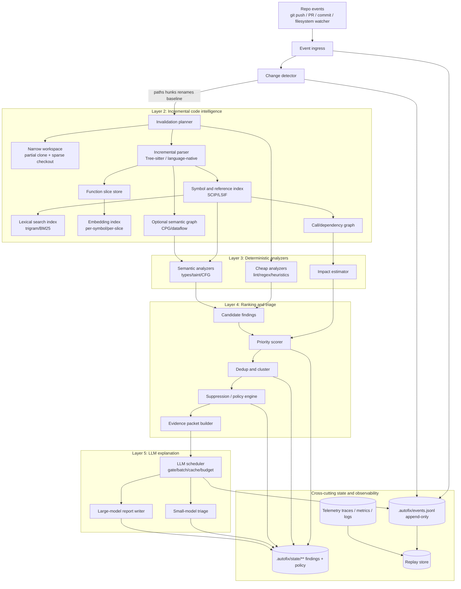
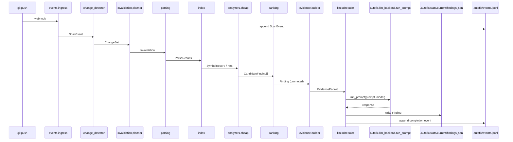

# Target architecture — event-driven, incremental scanner

- Source task: `task-20260417-001`
- Source report: `deep-research-report.md`
- Date: 2026-04-17

The target architecture migrates the current `autofix` scanner from a crawler-driven full-sweep loop to an event-driven, incremental program-analysis system whose LLM is called only on compact evidence packets at the end of a deterministic funnel. It installs as a sibling Python package `autofix_next/` and consumes the locked `autofix/llm_io/**`, `autofix/agent_loop.py`, `autofix/llm_backend.py`, `.autofix/state/**`, `.autofix/autofix-policy.json`, `.autofix/events.jsonl`, and `benchmarks/agent_bench/**` surfaces unchanged.

Sections with anchors that roadmap tasks link into: Reference architecture, Module boundaries, Data schemas, End-to-end scan, Integration with locked surfaces, Language registry, Clean-slate CLI surface, Deprecated CLI surface, Config compatibility.

## Reference architecture

The five-layer reference flow mirrors `deep-research-report.md` §Reference architecture. The diagram below is the authoritative high-level map; every downstream section refines one of its boxes.



## Module boundaries

The new package `autofix_next/` is composed of eight subpackages. Each subpackage names its entry modules and its public contracts. Every subpackage boundary is an import boundary — cross-package imports are restricted to the public contracts listed below so the roadmap can replace internals without breaking consumers.

### `autofix_next.events`
- Entry: `events/ingress.py`, `events/change_detector.py`.
- Public contract: `ingest(event: ScanEvent) -> ChangeSet`. Normalizes webhook / PR / commit / watcher signals and emits a deterministic `ChangeSet` covering changed paths, hunks, renames, and a `watcher_confidence` signal derived from the Watchman `is_fresh_instance` flag.

### `autofix_next.invalidation`
- Entry: `invalidation/planner.py`.
- Public contract: `plan(changeset: ChangeSet, index_state: IndexState) -> Invalidation`. Maps changed paths and AST ranges to the affected symbols, index shards, and dependency-graph edges. The planner never writes indexes itself; it emits an `Invalidation` plan that the parser / index workers consume.

### `autofix_next.parsing`
- Entry: `parsing/tree_sitter.py` (generic path), `parsing/language_native.py` (precision path).
- Public contract: `parse(path: Path, lang: Language) -> ParseResult` and `changed_ranges(prev: Tree, new: Tree) -> list[Range]`. Parse results are persisted as content-addressed blobs under `.autofix/state/index/` (locked write layout).

### `autofix_next.index`
- Entry: `index/symbols.py` (SCIP shards), `index/lexical.py` (trigram/BM25), `index/embedding.py` (HNSW sidecar), `index/graph.py` (call graph).
- Public contract: `get_symbol(symbol_id: str) -> SymbolRecord`, `query_lexical(q: str) -> list[Hit]`, `query_semantic(q: str) -> list[Hit]`, `callers_of(symbol_id: str) -> list[str]`. Each index is incrementally updated from an `Invalidation` plan.

### `autofix_next.analyzers`
- Entry: `analyzers/cheap/` (one submodule per rule family) and `analyzers/semantic/`.
- Public contract: `Analyzer.run(inputs: AnalyzerInputs) -> list[CandidateFinding]`. Cheap analyzers consume the ChangeSet + parse tree + lexical index; semantic analyzers consume the symbol index + optional semantic graph.

### `autofix_next.ranking`
- Entry: `ranking/scorer.py`, `ranking/dedup.py`, `ranking/suppression.py`, `ranking/impact.py`.
- Public contract: `score(candidate: CandidateFinding, features: Features) -> Priority`, `dedup(new: Finding, existing: list[Finding]) -> DedupDecision`, `suppress(finding: Finding, policy: Policy) -> SuppressionReason | None`. The policy loader reads `.autofix/autofix-policy.json` unchanged.

### `autofix_next.evidence`
- Entry: `evidence/builder.py`.
- Public contract: `build_packet(finding: Finding, index: IndexState) -> EvidencePacket`. The builder is the single producer of `EvidencePacket` instances; its output is the only input the LLM scheduler accepts.

### `autofix_next.llm`
- Entry: `llm/scheduler.py`, `llm/triage.py` (small-model path), `llm/report_writer.py` (large-model path).
- Public contract: `schedule(packet: EvidencePacket) -> ScheduleDecision`. The scheduler calls `autofix.llm_backend.run_prompt(...)` (locked) and `autofix.agent_loop.run_review_agent_loop(...)` (locked) through the existing function signatures — no changes are made to either module.

### `autofix_next.telemetry`
- Entry: `telemetry/tracer.py`, `telemetry/correlation.py`, `telemetry/replay.py`, `telemetry/sarif.py`.
- Public contract: `span(name: str, **attrs)` decorator/context manager, `append_event(event: ScanEvent)`, `replay(scan_id: str) -> ScanRun`, `export_sarif(scan_id: str) -> Path`. The replay store treats `.autofix/events.jsonl` as its first-class input.

## Data schemas

The schemas below are load-bearing contracts consumed by the locked LLM layer and by the dedup/replay subsystems. `EvidencePacket` in particular is declared with a `schema_version` field because the locked prompt prefix is keyed on it; bumping the version invalidates prompt-prefix caches and forces re-benchmarking.

### `SymbolRecord`

```json
{
  "$schema": "SymbolRecord",
  "repo_id": "payments-service",
  "commit_sha": "9f3d5a4",
  "symbol_id": "scip:payments-service#src/auth/jwt.go:ParseToken",
  "path": "src/auth/jwt.go",
  "language": "go",
  "kind": "function",
  "span": { "start_line": 118, "end_line": 188 },
  "signature": "func ParseToken(raw string) (*Claims, error)",
  "hashes": {
    "file_sha256": "...",
    "symbol_sha256": "...",
    "normalized_ast_sha256": "..."
  },
  "refs": {
    "callers": ["AuthMiddleware", "RefreshSession"],
    "callees": ["jwt.ParseWithClaims", "lookupKey"]
  },
  "freshness": {
    "last_indexed_at": "2026-04-17T13:20:11Z",
    "last_changed_commit": "9f3d5a4",
    "changed_ranges": [{ "start_byte": 2511, "end_byte": 2673 }]
  },
  "signals": {
    "fan_in": 19,
    "fan_out": 4,
    "churn_90d": 0.83,
    "ownership_top_owner_share": 0.41
  }
}
```

### `Finding`

```json
{
  "$schema": "Finding",
  "finding_id": "bug_01HZY9YV6X",
  "fingerprint_v1": "...",
  "rule_family": "tainted-deserialization",
  "repo_id": "payments-service",
  "commit_sha": "9f3d5a4",
  "status": "promoted",
  "location": {
    "path": "src/auth/jwt.go",
    "symbol_id": "scip:payments-service#src/auth/jwt.go:ParseToken",
    "primary_span": { "start_line": 147, "end_line": 153 }
  },
  "rank": {
    "priority": 92,
    "freshness": 88,
    "impact": 95,
    "confidence": 79,
    "novelty": 84
  },
  "duplicate_of": null,
  "suppression_reason": null
}
```

### `EvidencePacket`

```json
{
  "$schema": "EvidencePacket",
  "schema_version": "evidence_v1",
  "rule_id": "tainted-deserialization.json-unmarshal",
  "primary_symbol": "scip:payments-service#src/auth/jwt.go:ParseToken",
  "changed_slice": "claimsJson := decode(raw)\njson.Unmarshal(claimsJson, &claims)",
  "supporting_symbols": ["AuthMiddleware", "Claims"],
  "analyzer_traces": [
    {"engine": "taint", "path": ["raw", "claimsJson", "json.Unmarshal"]}
  ],
  "runtime_bundle": null,
  "prompt_prefix_hash": "sha256:..."
}
```

The v1 field list is deliberately minimal: `rule_id`, `primary_symbol`, `changed_slice`, `supporting_symbols`, `prompt_prefix_hash`, `schema_version`. Additional fields (callers/callees, failing tests, ownership snapshot) are marked "v1 subject to refinement by the evidence-builder roadmap task" and will land under the same `schema_version` only if they preserve the existing prompt-prefix cache keys.

### `ScanEvent`

```json
{
  "$schema": "ScanEvent",
  "event_id": "evt_01HZZ...",
  "event_type": "pr.commit",
  "repo_id": "payments-service",
  "commit_sha": "9f3d5a4",
  "base_sha": "9f3d5a3",
  "received_at": "2026-04-17T13:20:11Z",
  "watcher_confidence": 0.98,
  "source": "github_webhook"
}
```

`ScanEvent` instances are appended to `.autofix/events.jsonl` (locked) so the replay store can reconstruct a run deterministically.

## End-to-end scan sequence

The numbered flow below walks a single end-to-end scan from a git push through to a report-writer LLM call. Each step names the owning subpackage and calls out the locked surfaces it touches. A mermaid `sequenceDiagram` rendering follows.

1. A `git push` webhook arrives; `autofix_next.events.ingress` normalizes it into a `ScanEvent` and appends the event to `.autofix/events.jsonl` (locked append-only log).
2. `autofix_next.events.change_detector` runs `git diff --histogram base..head` and combines it with watcher clock deltas to produce a `ChangeSet` of paths + hunks + renames.
3. `autofix_next.invalidation.planner` maps the `ChangeSet` to an `Invalidation` plan: which symbol IDs, lexical shards, embedding slots, and call-graph edges are stale.
4. `autofix_next.parsing` re-parses only the files in the `Invalidation`, producing `ParseResult` blobs. Tree-sitter `changed_ranges()` keeps the repair scoped to structurally changed regions.
5. `autofix_next.index` updates the SCIP symbol shards, the trigram/BM25 lexical index, and (on the precision path) the embedding sidecar and call/dependency graph.
6. `autofix_next.analyzers.cheap` runs rule engines over the parsed slices and emits `CandidateFinding` objects.
7. `autofix_next.ranking.scorer` scores each candidate by the research-report formula `0.35*impact + 0.25*freshness + 0.20*confidence + 0.10*novelty + 0.10*owner_risk`.
8. `autofix_next.ranking.dedup` applies the three-tier dedup (exact fingerprint → SimHash → embedding similarity) against findings already in `.autofix/state/current/findings.json` (locked shape).
9. `autofix_next.ranking.suppression` applies `.autofix/autofix-policy.json` (locked shape) and drops suppressed findings with a recorded reason.
10. `autofix_next.evidence.builder` constructs an `EvidencePacket` for each promoted candidate, stamping `schema_version` and computing `prompt_prefix_hash`.
11. `autofix_next.llm.scheduler` gates the packet: duplicates and low-priority candidates are dropped, medium-priority ones go to the small-model triage, high-priority promoted ones go to the large-model report writer.
12. The scheduler calls `autofix.llm_backend.run_prompt(...)` (locked) — optionally via `autofix.agent_loop.run_review_agent_loop(...)` (locked) for multi-turn review — and writes the resulting finding to `.autofix/state/current/findings.json` (locked).
13. `autofix_next.telemetry` emits OTel spans for every stage, keyed by the `event_id` correlation ID, and appends a completion event to `.autofix/events.jsonl`.



## Integration with locked surfaces

This section is the load-bearing contract that keeps the new core loop from accidentally editing the locked surfaces. Every call site named below invokes an existing function signature unchanged; no file under `autofix/llm_io/**`, `autofix/agent_loop.py`, `autofix/llm_backend.py`, `.autofix/state/**`, `.autofix/autofix-policy.json`, `.autofix/events.jsonl`, or `benchmarks/agent_bench/**` is modified.

- **`autofix.llm_backend.run_prompt`** — invoked exclusively from `autofix_next.llm.scheduler.schedule` and from `autofix_next.llm.report_writer.write`. Arguments are unchanged; `autofix_next` passes the prompt body, model tier, and timeout. The scheduler never instantiates its own provider client.
- **`.autofix/state/current/findings.json`** — written through the existing helpers in `autofix/state.py` (`save_findings`, `dedup_finding`) which already enforce the locked schema. `autofix_next.ranking.dedup` and `autofix_next.llm.scheduler` call these helpers; they do not `open(...)` the file directly.
- **`.autofix/events.jsonl`** — appended through the `append_event` helper in `autofix/state.py` (which calls `write_state_snapshot` under the locked layout in `autofix/platform.py`). Every stage in `autofix_next` that writes an event uses this helper.
- **`benchmarks/agent_bench/autofix_adapter.build_agent(model, max_steps, timeout)`** — the adapter contract is preserved. When a fixture invokes `build_agent(...)`, the returned `AgentCallable` still routes through `autofix.agent_loop.run_agent_loop` / `run_review_agent_loop`; the new scheduler inserts itself behind the same seam when the fixture opts into the new loop via an environment flag, but the public signature of `build_agent` does not change.
- **`autofix.agent_loop.run_agent_loop` and `run_agent_loop.run_review_agent_loop`** — the multi-turn review loop remains the single entry into the provider-side agent flow; `autofix_next.llm.scheduler` invokes them with the packet body as the `prompt` argument. The locked functions' signatures, return shapes, and JSON validation (via `autofix/llm_io/validation.py`) are unchanged.
- **`autofix/llm_io/prompting.py`** — the evidence-packet builder reuses the existing prompt-path resolution and chunked-review helpers without modification; `autofix_next.evidence.builder` imports them as a library.
- **Benchmark trace hooks** — `autofix_next` re-exports `benchmark_trace_llm` and `benchmark_trace_tool` from `autofix/benchmarking.py` so agent-bench instrumentation sees both the legacy call sites and the new scheduler call sites without new hook registration.

## Language registry

The language registry sits between the parser and the analyzers so additional languages can be added without touching core. Every adapter implements a Python `Protocol`; the registry exposes `register(adapter: LanguageAdapter)` and `lookup(lang: Language) -> LanguageAdapter`.

```python
from typing import Protocol, runtime_checkable

@runtime_checkable
class LanguageAdapter(Protocol):
    language: str  # "python" | "javascript" | "typescript" | "go" | ...
    extensions: tuple[str, ...]

    def parse_cheap(self, source: bytes) -> "ParseResult": ...
    def parse_precise(self, source: bytes) -> "ParseResult | None": ...
    def symbol_kind(self, node) -> str: ...
    def signature(self, node) -> str: ...
    def scip_index(self, workdir) -> "Path | None": ...
```

Adapters may leave `parse_precise` or `scip_index` returning `None` if the precision path is not yet wired; the core loop falls back to the cheap path automatically. The registry is intentionally asymmetric so an adapter can provide both the cheap Tree-sitter path and the precise SCIP/LSIF path, selected per promoted candidate rather than globally.

### `PythonAdapter`
The Python adapter uses the Tree-sitter Python grammar for the cheap path and `scip-python` for the precision path. It maps function and class definitions to `SymbolRecord.kind` values, derives signatures from AST headers, and emits SCIP shards into the locked `.autofix/state/index/` layout. The adapter reuses the existing `ast`-based helpers in `autofix/crawler.py` as a read-only fallback for repositories where `scip-python` cannot be installed, so the new loop degrades gracefully rather than failing.

### `JSTSAdapter`
The JavaScript/TypeScript adapter uses the Tree-sitter JavaScript and TypeScript grammars for the cheap path and `scip-typescript` for the precision path (the latter handles both `.js` and `.ts` via the TypeScript compiler service). It canonicalizes JSX/TSX into the same symbol kinds as plain JS/TS, and it is the first adapter where the precision path materially outperforms the cheap path on signatures because TypeScript type information lands only through `scip-typescript`.

### `GoAdapter`
The Go adapter uses Tree-sitter Go for the cheap path and `scip-go` for the precision path. Because Go modules are the unit of semantic analysis, the adapter's `scip_index` runs `scip-go` at module granularity and caches shards by module path + module checksum so a commit that only touches one module invalidates one shard. Go's call graph is a first-class input to the impact estimator because interface satisfaction rules make fan-in harder to compute without a precise index.

Additional languages are added by writing a new module that satisfies `LanguageAdapter` and registering it at import time. No core changes are required.

## Clean-slate CLI surface

The new CLI is invoked as `autofix-next` (or `autofix` after the clean-slate cutover). It is intentionally small; non-core operations are handled by the replay and export subcommands.

1. `autofix-next scan` — run a scan for the current repo. Flags: `--event <path-to-event-json>` (optional; defaults to a synthetic "full sweep" event), `--commit <sha>` (override HEAD), `--policy <path>` (override `.autofix/autofix-policy.json`), `--budget-tokens <n>`, `--dry-run`.
2. `autofix-next watch` — start a long-running watcher (Watchman-backed). Flags: `--root <path>`, `--since <clock>`, `--safety-sweep <cron>`.
3. `autofix-next replay` — reproduce a past scan from `.autofix/events.jsonl`. Flags: `--scan-id <id>`, `--commit <sha>`, `--analyzers-version <ver>`, `--policy-snapshot <path>`.
4. `autofix-next export sarif` — emit SARIF for a scan. Flags: `--scan-id <id>`, `--out <path>`.
5. `autofix-next show finding` — pretty-print a finding and its evidence packet. Flags: `--id <finding-id>`, `--json`.
6. `autofix-next index` — rebuild or inspect the index. Subcommands: `rebuild`, `status`, `vacuum`. Flags: `--language <lang>`, `--precision` (force precision path).
7. `autofix-next policy` — read or inspect the loaded policy (shape unchanged vs. `.autofix/autofix-policy.json`). Flags: `--show`, `--validate`. Write path is intentionally absent; policy edits remain a file-edit operation.
8. `autofix-next doctor` — run a health check covering index freshness, event log integrity, and LLM provider reachability.

## Deprecated CLI surface

The current `autofix/cli.py` defines twelve top-level subcommands. Each is listed below with its status in the clean-slate CLI. The legacy CLI is not removed by this task; it is replaced, renamed, or marked for removal and retained until the clean-slate cutover roadmap task lands.

1. `autofix scan --root <path>` — **replaced** by `autofix-next scan --event <...>`. The `--root` flag disappears; the new CLI infers the repo root from cwd and from the `ScanEvent`.
2. `autofix list` — **replaced** by `autofix-next show finding --json`. The list semantics are preserved but delivered through the same finding-inspection command.
3. `autofix clear` — **removed**. Clearing findings is now a side effect of `autofix-next index vacuum` plus a policy-driven retention window; there is no first-class "clear" verb.
4. `autofix policy` — **renamed** to `autofix-next policy --show`. Behavior unchanged (reads `.autofix/autofix-policy.json`).
5. `autofix sync-outcomes` — **replaced** by a background job triggered from `autofix-next watch`; the explicit subcommand is retired because outcomes sync is now event-driven.
6. `autofix benchmark` — **removed** from the core CLI. Benchmark summaries move into `benchmarks/agent_bench/` harness outputs; the core CLI no longer reports benchmark metrics directly.
7. `autofix suppress` — **renamed** to `autofix-next policy --edit suppression ...` as a future successor initiative. Until that successor lands, suppressions remain file-edit operations on `.autofix/autofix-policy.json`.
8. `autofix init` — **replaced** by `autofix-next doctor --init` (guided setup) and by a documented manual policy file template. The explicit `init` verb is retired.
9. `autofix daemon` — **replaced** by `autofix-next watch` (Watchman-backed; Watchman `is_fresh_instance` signals flow into the change detector).
10. `autofix repo` — **removed**. Multi-repo management moves out of the core CLI; orchestration lives in an external runner (cron, CI matrix, or a separate `autofix-next-orchestrator`).
11. `autofix config` — **renamed** to `autofix-next policy --show` / `--validate`; there is no separate "config" verb because `.autofix/autofix-policy.json` is the single source of truth.
12. `autofix scan-all` — **replaced** by external orchestration that invokes `autofix-next scan` per-repo. The built-in multi-repo sweep is retired.

## Config compatibility

The new CLI reads `.autofix/autofix-policy.json` in its existing shape without modification. The policy-layer lock list includes this file; any future schema evolution is a successor initiative and is called out in `roadmap.md`. The risk the config layer guards against is that a clean-slate CLI silently invents a parallel `autofix-next-policy.json`; that is explicitly forbidden by the locked-surfaces contract above. The `ranking.suppression` subpackage reads the locked policy shape, and the `ranking.scorer` subpackage reads its thresholds (e.g. `min_priority_for_llm_triage`) from the same file.

The benchmark adapter contract in `benchmarks/agent_bench/autofix_adapter.py` — specifically `build_agent(model, max_steps, timeout) -> AgentCallable(workdir, fixture)` — is preserved byte-identically so existing agent-bench fixtures keep running against the new loop when the opt-in environment flag is set and against the legacy loop otherwise.
